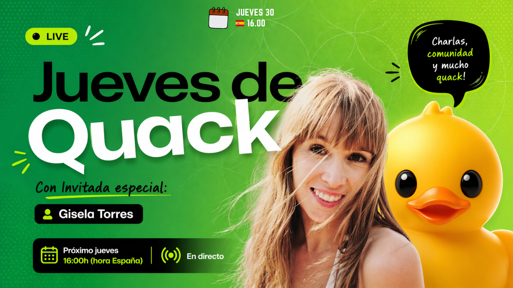

# 🦆 Jueves de Quack — Sopla el Cartucho

<div align="center">

[](https://www.youtube.com/c/GiselaTorres?sub_confirmation=1)
[](https://github.com/0GiS0)
[](https://www.linkedin.com/in/giselatorresbuitrago/)
[](https://twitter.com/0GiS0)

</div>

---

¡Hola developer 👋🏻! Este proyecto es una web retro con estilo **Game Boy** que muestra las sesiones de **Jueves de Quack**, la iniciativa comunitaria del canal de [GitHub en YouTube](https://www.youtube.com/@GitHub) en español. Cada sesión se representa como un **cartucho de Game Boy** que puedes "soplar" antes de jugar.

<a href="https://youtu.be/VMPap6uuErU">
 
</a>

## 📑 Tabla de Contenidos

- [Características](#-características)
- [Demo](#-demo)
- [Tecnologías Utilizadas](#-tecnologías-utilizadas)
- [Requisitos Previos](#-requisitos-previos)
- [Instalación](#-instalación)
- [Uso](#-uso)
- [Estructura del Proyecto](#-estructura-del-proyecto)
- [Créditos de Diseño](#-créditos-de-diseño-codepen)
- [Licencia](#-licencia)
- [Sígueme](#-sígueme-en-mis-redes-sociales)

## ✨ Características

- 🎮 **Diseño retro Game Boy** — Interfaz nostálgica con estética pixel art
- 📼 **Cartuchos de sesiones** — Cada episodio de Jueves de Quack tiene su propio cartucho
- 🦆 **Datos de YouTube RSS** — Las sesiones se obtienen automáticamente del feed RSS del canal
- 🎬 **Start → YouTube** — Al pulsar START en la consola, se abre el vídeo del cartucho seleccionado
- 📱 **Responsive** — Funciona en desktop y móvil

## 🌐 Demo

Puedes ver la web en funcionamiento en: **[0GiS0.github.io/sopla-el-cartucho-en-jueves-de-quack](https://0GiS0.github.io/sopla-el-cartucho-en-jueves-de-quack)**

## 🛠️ Tecnologías Utilizadas

| Tecnología                                    | Uso                                        |
| --------------------------------------------- | ------------------------------------------ |
| [Astro](https://astro.build/)                 | Framework web estático (SSG)               |
| [TypeScript](https://www.typescriptlang.org/) | Tipado estático en todo el proyecto        |
| [Sharp](https://sharp.pixelplumbing.com/)     | Pipeline de generación de assets pixel art |
| CSS Custom Properties                         | Theming retro sin dependencias externas    |

## � Requisitos Previos

- **Node.js** versión 18 o superior
- **npm** (incluido con Node.js)
- Conexión a internet para descargar las sesiones del feed RSS

## 🚀 Instalación

### Paso 1: Clonar el repositorio

```bash
git clone https://github.com/0GiS0/sopla-el-cartucho-en-jueves-de-quack.git
cd sopla-el-cartucho-en-jueves-de-quack
```

### Paso 2: Instalar dependencias

```bash
npm install
```

### Paso 3: Descargar sesiones desde YouTube RSS

```bash
npm run fetch-sessions
```

### Paso 4: Iniciar servidor de desarrollo

```bash
npm run dev
```

El servidor estará disponible en `http://localhost:4321`

## 💻 Uso

### Desarrollo local

```bash
npm run dev          # Inicia el servidor de desarrollo
npm run build        # Genera la build de producción
npm run preview      # Previsualiza la build de producción
```

### Generación de assets

```bash
npm run fetch-sessions    # Descarga las sesiones del RSS de YouTube
npm run generate:assets   # Genera avatares 8-bit
npm run generate:covers   # Genera portadas de cartuchos
npm run generate:all      # Genera todos los assets
```

### Calidad de código

```bash
npm run lint         # Ejecuta ESLint
npm run format       # Formatea el código con Prettier
npm test             # Ejecuta los tests
```

## 📁 Estructura del proyecto

```
src/
├── components/     # Componentes Astro
│   ├── Console.astro        # Consola Game Boy CSS
│   ├── CartridgeCard.astro  # Cartucho de sesión
│   └── Navigation.astro     # Navegación
├── data/           # Datos de sesiones y assets
├── layouts/        # Layouts base
├── lib/            # Utilidades y helpers
├── pages/          # Páginas de la web
├── schemas/        # Esquemas Zod
├── styles/         # Estilos globales
└── types/          # Tipos TypeScript
scripts/
├── fetch-sessions.ts    # Descarga sesiones del feed RSS de YouTube
├── generate-assets.ts   # Genera avatares 8-bit
└── generate-covers.ts   # Genera portadas de cartuchos
```

## 🎨 Créditos de diseño (CodePen)

El diseño retro se basa en trabajos publicados en CodePen bajo licencia MIT:

| Componente                                 | Autor     | Enlace                                                                       |
| ------------------------------------------ | --------- | ---------------------------------------------------------------------------- |
| Game Boy CSS art (`Console.astro`)         | Brandon   | [codepen.io/brundolf/pen/beagbQ](https://codepen.io/brundolf/pen/beagbQ)     |
| Game Boy cartridge (`CartridgeCard.astro`) | Van Huynh | [codepen.io/worksbyvan/pen/MoxroE](https://codepen.io/worksbyvan/pen/MoxroE) |

## 📄 Licencia

MIT

---

## 🌐 Sígueme en Mis Redes Sociales

Si te ha gustado este proyecto y quieres ver más contenido como este, no olvides suscribirte a mi canal de YouTube y seguirme en mis redes sociales:

<div align="center">

[](https://www.youtube.com/c/GiselaTorres?sub_confirmation=1)
[](https://github.com/0GiS0)
[](https://www.linkedin.com/in/giselatorresbuitrago/)
[](https://twitter.com/0GiS0)

</div>
